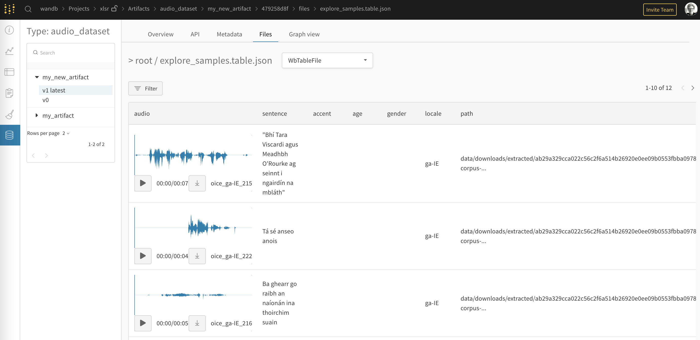

# XLSR Finetune
> A bunch of handy functions to make fine-tuning the XLSR-Wav2Vec2 speech recognition model much easier


Much of the code in this project is taken from Patrick Von Platen's brilliant Hugging Face [blog post here](https://huggingface.co/blog/fine-tune-xlsr-wav2vec2), 💯 thanks to the team!

(Work in Progress)

## Quickly Explore Your Audio Dataset

With a couple of lines you can upload some of all of your dataset to quickly explore your dataset. You can play the audio as well as sort and group columns


```
!pip install git+https://github.com/morganmcg1/xlsr_finetune.git

import wandb
from xlsr.wandbutils import *

wandb.login

explore = WandbDataExplorer(ds=test_ds, n_samples=100, 
                            artifact_name = 'my_new_artifact', artifact_type='audio_dataset',
                            table_name='explore_samples', wandb_project = 'xlsr',
                            cols_to_exclude=['client_id','segment'])
                            
explore.log()
```

The code above will generate this:



## Demo Training Demo

`xlsr_finetune/notebooks/_train_demo.ipynb`

This repo also includes an end-to-end training demo, based on the [Hugging Face ASR blog](https://huggingface.co/blog/fine-tune-xlsr-wav2vec2), including showing how to filter your data, and save it to and download from Weigths & Biases Artifacts 

## Install

```
git clone https://github.com/morganmcg1/xlsr_finetune.git

cd xlsr_finetune

pip install -e .

```

or you can run the below directly from a notebook

```
pip install git+https://github.com/morganmcg1/xlsr_finetune.git
```

## Contributing

To contribute, make sure you have the latest version of nbdev installed and check out the CONTRIBUTING.md file
